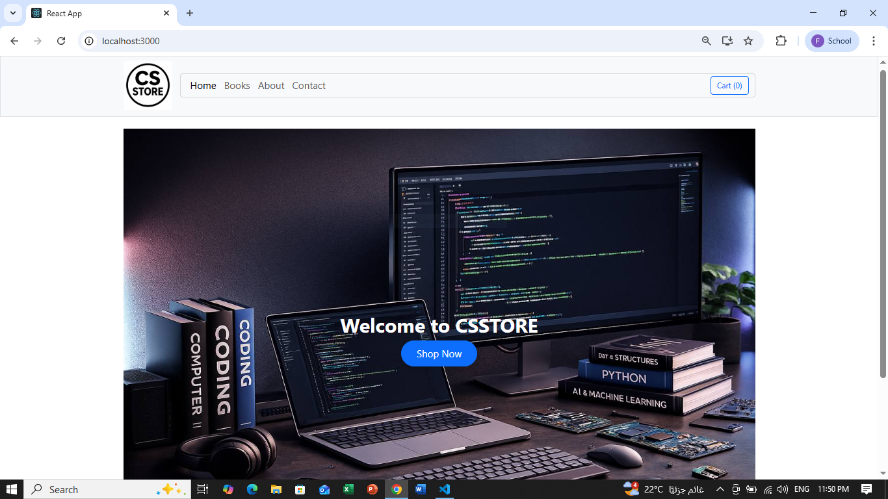
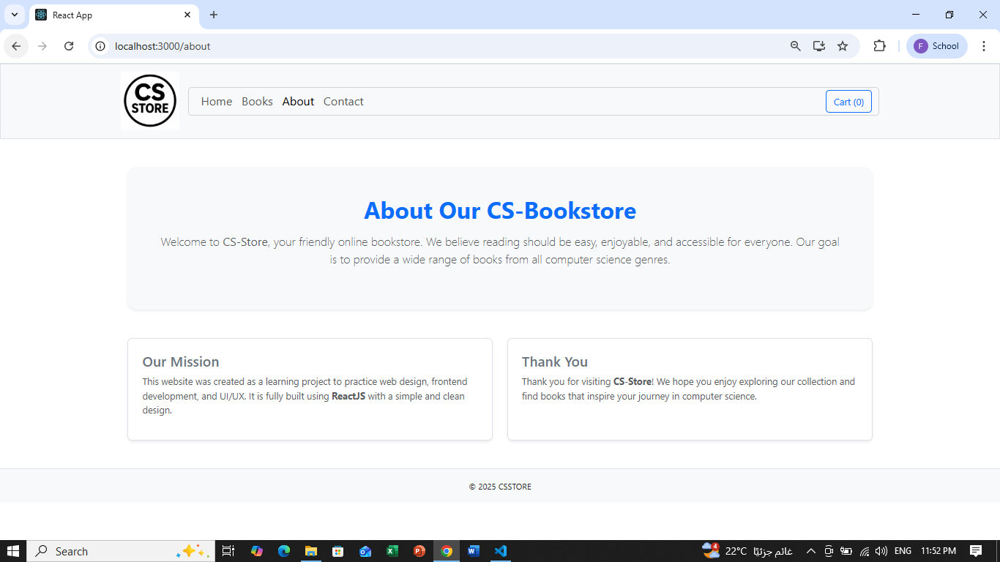

 

# CSSTORE
## DESCRIPTION
CSStore is an online bookstrore dedicated to computer science literature.IT offers different books topic in computer science and the most popular ones.

git clone <Fatima-YH>
cd <Fatima-YH>

# Screenshoots:

## HOME PAGE

## BOOKS PAGE
 <!--this is not the whole page-->

## ABOUT PAGE

## CONTACT PAGE 

## CART PAGE
